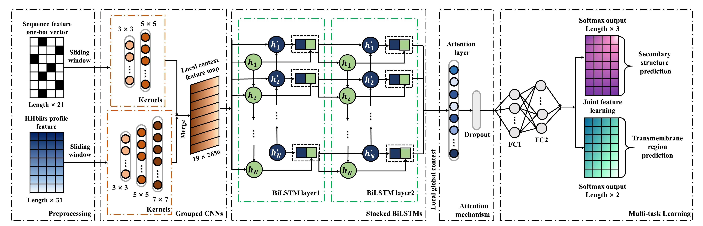

# TMP-SS
A Deep Learning-Based Predictor for Secondary Structure & Topology Structure Prediction of Alpha-helical Transmembrane Proteins.

<p align="center"></p>

## Download data
We provide the test dataset used in this study,  you can download TEST.fasta to evaluate our method.

## Quick Start

### Requirements
- Python ≥ 3.6
- Tensorflow and Keras
- HH-suite for generating HHblits files (with the file suffix of .hhm)

### Download TMP-SS
```
git clone https://github.com/Liuzhe30/TMP-SS.git
```
You can download the model weights from [OneDrive url](https://1drv.ms/u/s!AjoZI2sogng51Dxxmfn2DPL79ft5?e=wcBXbe).

### Test & Evaluate in Command Line
We provide run.py that is able to run pre-trained models. Run it with:
```
python run.py -f sample/sample.fasta -p sample/hhblits/ -o results/
```

* To set the path of fasta file, use `--fasta` or `-f`.
* To set the path of generated HHblits files, use `--hhblits_path` or `-p`.
* To save outputs to a directory, use `--output` or `-o`.

## Progress
- [x] README for running TMP-SS.

## Citation
Please cite the following paper for using this code: 
```
Liu Z, Gong Y, Bao Y, Guo Y, Wang H, Lin GN. TMPSS: A Deep Learning-Based Predictor for Secondary Structure and Topology Structure Prediction of Alpha-Helical Transmembrane Proteins. Front Bioeng Biotechnol. 2021 Jan 25;8:629937. doi: 10.3389/fbioe.2020.629937. PMID: 33569377; PMCID: PMC7869861.
```